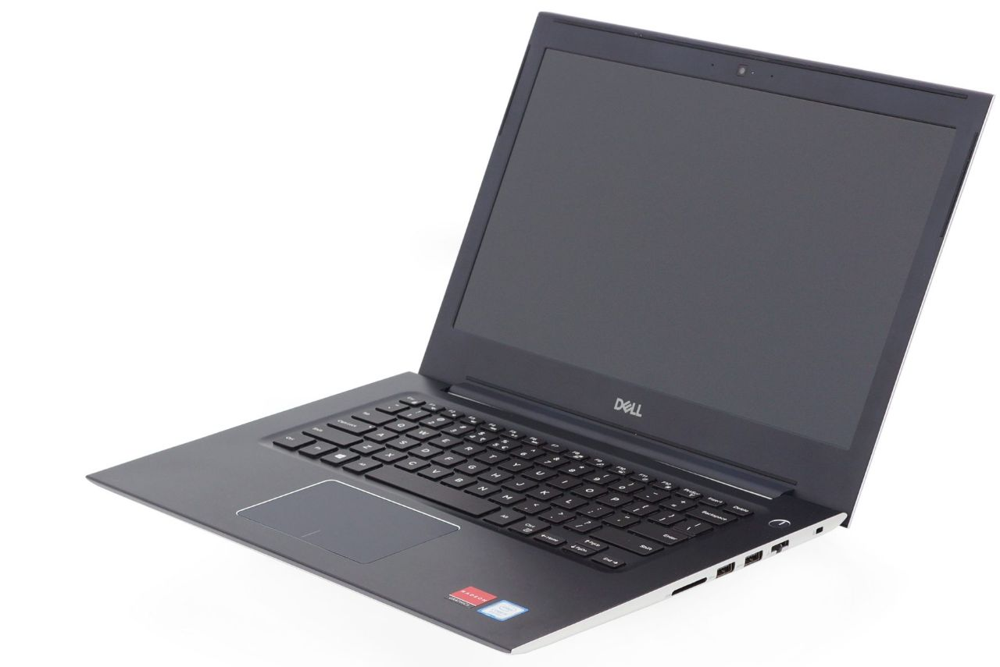
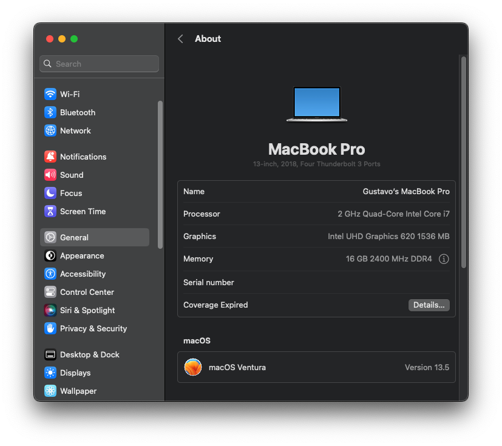
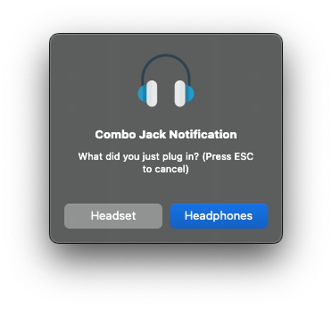

# Hackintosh of Dell Vostro 5471 with Mac OS Ventura

EFI for Dell Vostro 5471 with OpenCore 0.9.3 bootloader



### Computer Spec:

| Component        | Brank                              |
| ---------------- | ---------------------------------- |
| CPU              | Intel® i7 8550U (KBL-R)            |
| iGPU             | Intel® UHD Graphics 620            |
| dGPU             | AMD Radeon 530 (disabled on macOs) |
| Display          | 14" FHD 1920x1080                  |
| Audio            | Realtek ALC295                     |
| Ram              | 32 Gb ddr4 2400 Mhz                |
| Lan              | Realtek 8168                       |
| Wifi + Bluetooth | BCM943602BAED (replaced)           |
| NVMe             | Samsung 970 EVO PLUS 500 GB        |
| SSD              | Samsung 850 EVO 500 GB             |
| SmBios           | MacbookPro 15,2                    |
| BootLoader       | OpenCore 0.6.2                     |




### What works and What doesn't or WIP:

- [x] Intel UHD 620 iGPU eDP Output (with Backlight)
- [x] Intel UHD 620 iGPU HDMI Output
- [x] Intel UHD 620 iGPU Type-C to HDMI Output
- [x] ALC295 Internal Speakers
- [x] ALC295 Native Combojack headphones
- [x] ALC295 HDMI Audio Output
- [x] All USB Ports + SD reader
- [x] SpeedStep / Sleep / Wake
- [x] I2C Touchpad with gesture
- [x] Brightness Key
- [x] Wi-Fi and Bluetooth BCM943602BAED (DW1830) Module
- [x] Realtek RTL8168 LAN
- [x] USB Cardreader
- [x] ACPI Battery
- [x] NVRAM
- [x] Windows boot from OpenCore
- [ ] Fingerprint (unsupported)
- [ ] dGPU Amd 530 (unsupported)
- [ ] ALC295 Combojack microphone

### BIOS Information:
- Enable Legacy Option ROMs: **OFF**
- SATA Operation: **AHCI**
- Drives: **only M.2 PCIe SSD-0 (512GB) is enabled**
- SMART reporting: **OFF**
- PPT Security, PTT: **OFF**
- Secure Boot: **OFF**
- Intel SGX: **Disabled**
- Multi Core support: **All**
- Intel SpeedStep: **ON**
- C States: **ON**
- Intel Turbo Boost: **ON**
- HyperThread: **Enabled**
- Intel Speed Shift: **ON**
- USB Wake: **OFF**
- Block sleep: **OFF**
- FN Lock: **ON**
- FN Lock Mode: **Disable/Standard**
- Fastboot: **Thorough**
- Intel Virtualization Technology: **Enabled**
- VT for Direct I/O: **Disabled**
- Wireless and Bluetooth: **ON**
- Auto OS Recovery Threshold: **OFF**

### Special Config:

- Usb port mapping performed
- SSDT-Hack Essential patch
- Applied cosmetics PCI Dev

### Post Install:
#### Combo Jack

To your headphones works, you need to install Combo Jack:

**Open terminal and run:**
```
chmod +x PostInstall/ComboJackAlc295/install.sh
./PostInstall/ComboJackAlc295/install.sh
```


## Credits

- [Apple](https://apple.com) for macOS;
- [Acidanthera](https://github.com/acidanthera) for OpenCore and all the lovely hackintosh work.
- [Dortania](https://github.com/dortania) for their detailed guides.
- [Lorys89](https://github.com/Lorys89) for first version of this EFI
- [Hackintoshlifeit](https://github.com/Hackintoshlifeit)
- [gustavorglima](https://github.com/gustavorglima) for updating this EFI OpenCore and Mac OS Ventura
